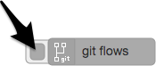
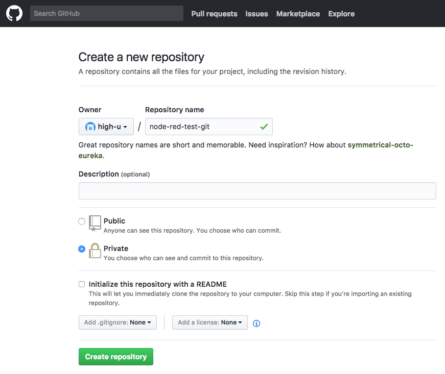

# node-red-contrib-git-flows

For Node-RED.

Manage the flow in git repository.


## Feature

- When you press the button, git command are executed automatically.
  - git add
  - git commit
  - git push
- Split flows.json to make diff easy to see.
  - For function nodes, such files are created.
    - nodes/{node.id}/func

## Diff 

### example

```diff
-if (true) {
-    console.log('Hello world.')
+if (false) {
+    console.log('Goodbye world.')
 }
 return msg
```

### github example


## install

```bash
npm install --save node-red-contrib-git-flows
```

## Usage

### Local git

1. Check `git repository (ssh)` property.
    - 
2. Press node button.
    - 

### Push to github

1. Register ssh key.
    - https://github.com/settings/keys
2. Make an empty repository newly.
    - 
3. Input `git repository (ssh)` property.
    - 
4. Press node button.
    - 

## Dependence

- git command


