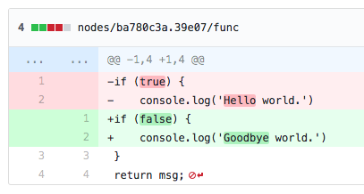

# node-red-contrib-git-flows

## feature

- When you press the button, git command are executed automatically.
  - git add
  - git commit
  - git push
- Split flows.json to make diff easy to see.
  - For function nodes, such files are created.
    - nodes/{node.id}/func

## Diff 

### example

```diff
-if (true) {
-    console.log('Hello world.')
+if (false) {
+    console.log('Goodbye world.')
 }
 return msg
```

### github example



## install

```bash
npm install --save node-red-contrib-git-flows
```

## usage


## warning

